# AI Character System - Process Sequence Documentation

This document describes the sequence of processes in the AI Character Voice Interaction System.

## Table of Contents

1. [High-Level Architecture](#high-level-architecture)
2. [Text Chat Flow](#text-chat-flow)
3. [Voice Chat Flow](#voice-chat-flow)
4. [CrewAI Agent Orchestration](#crewai-agent-orchestration)
5. [Database Operations](#database-operations)
6. [WebSocket Real-time Flow](#websocket-real-time-flow)

---

## High-Level Architecture

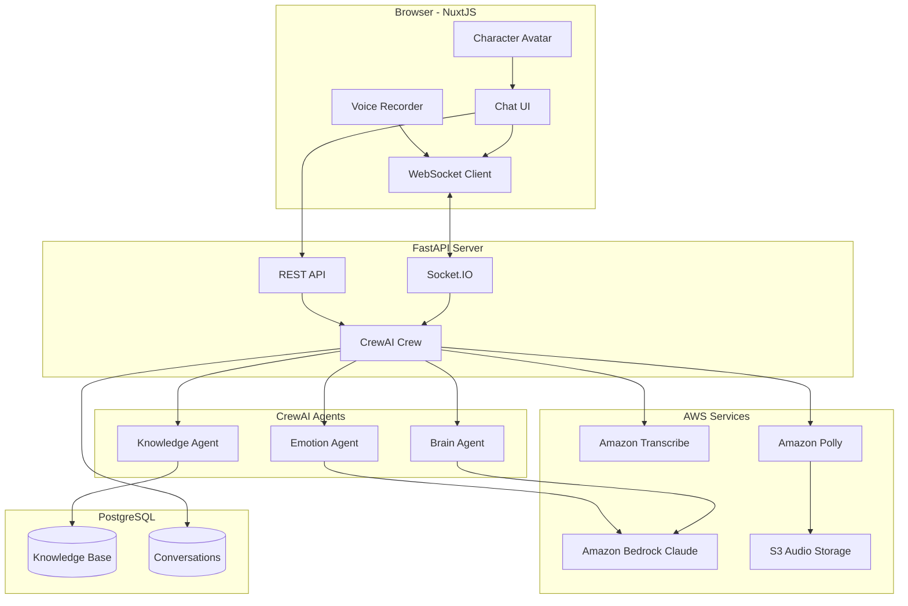

---

## Text Chat Flow

### Sequence Diagram

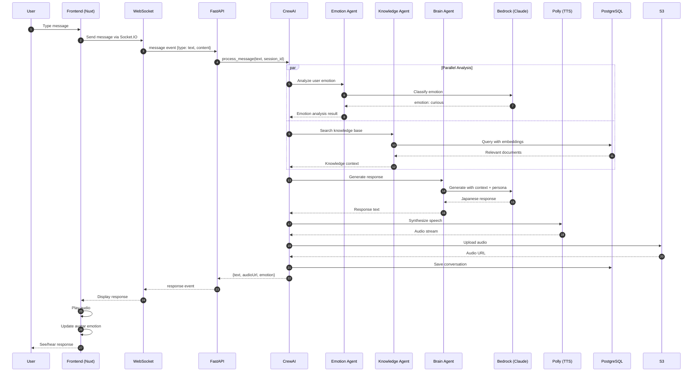

### Process Steps

| Step | Component | Action | Details |
|------|-----------|--------|---------|
| 1 | Frontend | User types message | Text input captured |
| 2 | WebSocket | Send to server | Socket.IO `message` event |
| 3 | FastAPI | Receive message | Parse {type, content, sessionId} |
| 4 | CrewAI | Start pipeline | Initialize crew processing |
| 5 | Emotion Agent | Analyze sentiment | Uses Bedrock Claude |
| 6 | Knowledge Agent | Search database | pgvector semantic search |
| 7 | Brain Agent | Generate response | Context-aware, persona-driven |
| 8 | Polly | Text-to-speech | Japanese neural voice |
| 9 | S3 | Store audio | Generate presigned URL |
| 10 | Database | Save conversation | For history/context |
| 11 | Frontend | Display response | Text + audio + avatar |

---

## Voice Chat Flow

### Sequence Diagram

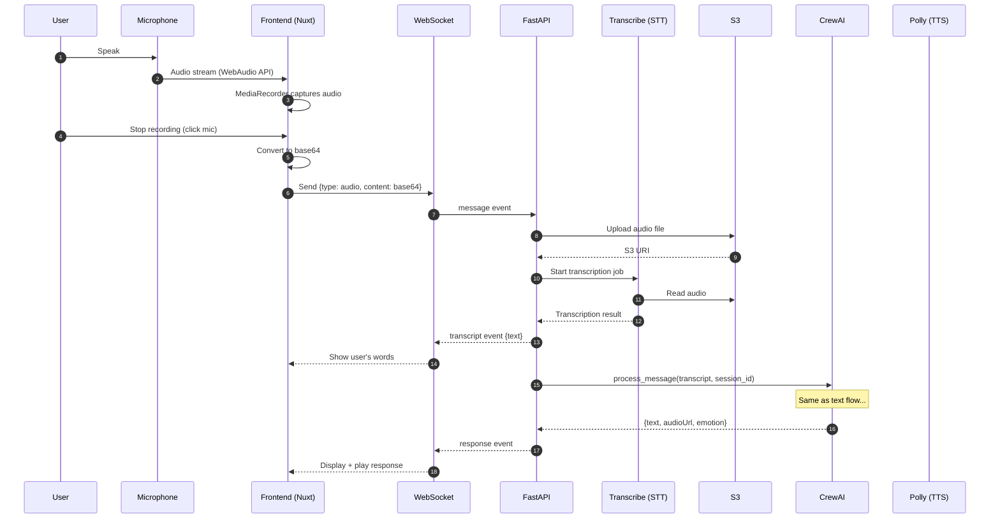

### Voice Processing Details

```mermaid
flowchart LR
    subgraph Capture [Audio Capture]
        Mic[Microphone] --> WA[Web Audio API]
        WA --> MR[MediaRecorder]
        MR --> Blob[Audio Blob]
    end

    subgraph Transfer [Data Transfer]
        Blob --> B64[Base64 Encode]
        B64 --> WS[WebSocket]
    end

    subgraph STT [Speech-to-Text]
        WS --> S3U[S3 Upload]
        S3U --> TR[Transcribe Job]
        TR --> TXT[Japanese Text]
    end

    subgraph Process [AI Processing]
        TXT --> Crew[CrewAI]
        Crew --> Resp[Response Text]
    end

    subgraph TTS [Text-to-Speech]
        Resp --> Polly[AWS Polly]
        Polly --> MP3[MP3 Audio]
        MP3 --> S3D[S3 Download URL]
    end
```

---

## CrewAI Agent Orchestration

### Agent Hierarchy

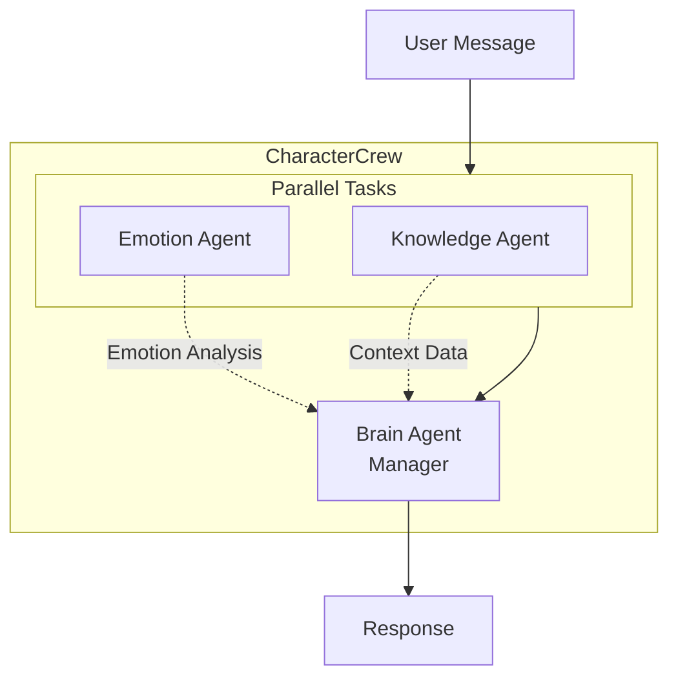

### Agent Responsibilities

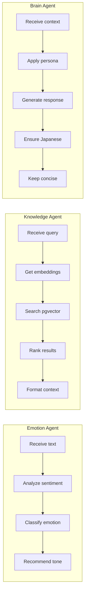

### Task Flow

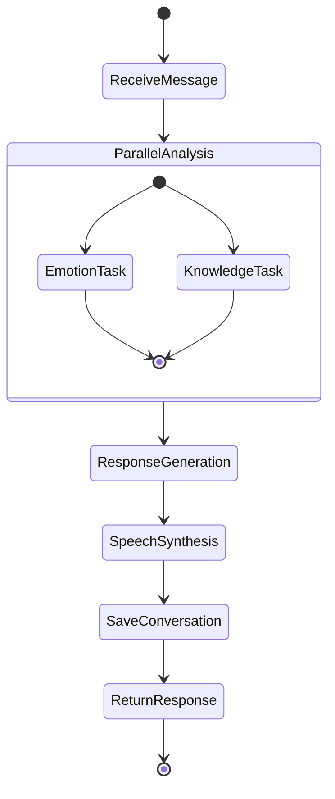

---

## Database Operations

### Schema Relationships

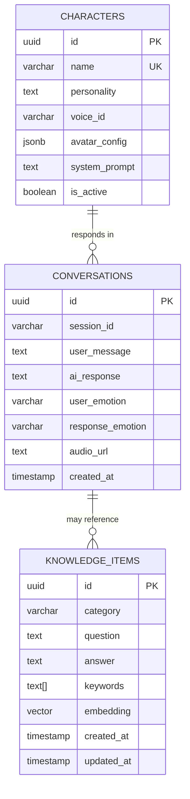

### Query Flow

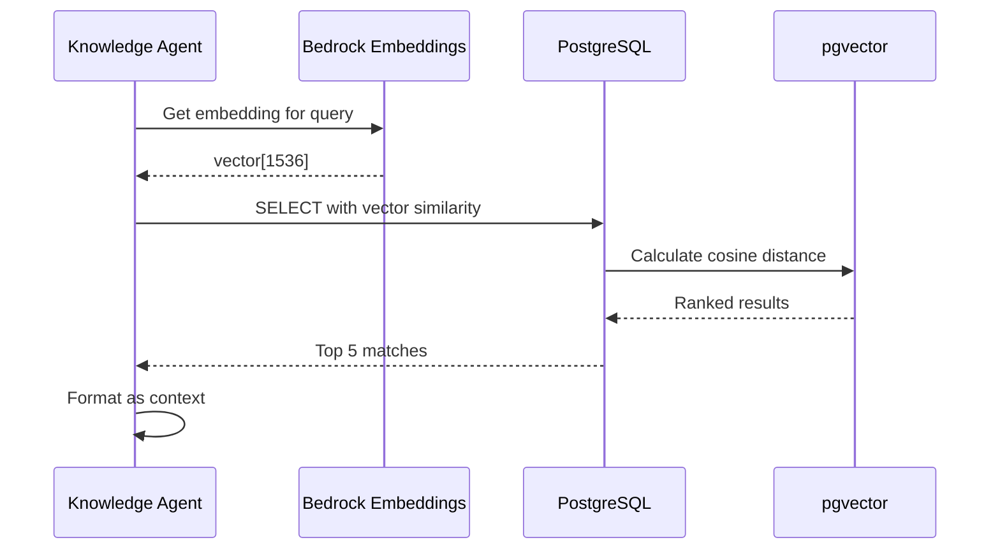

---

## WebSocket Real-time Flow

### Connection Lifecycle

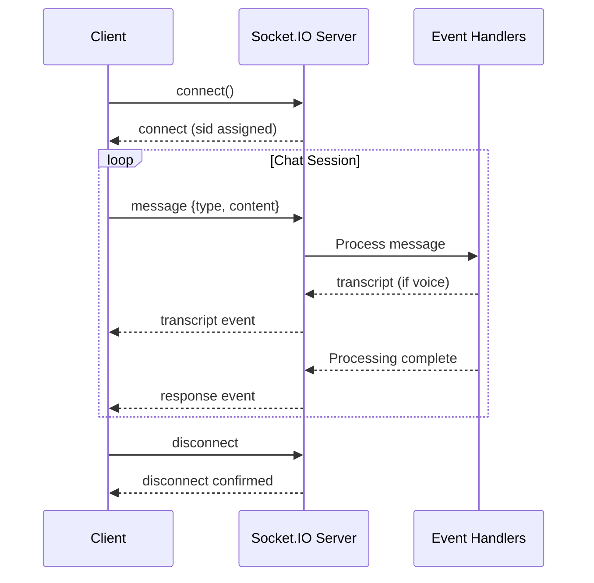

### Event Types

```mermaid
flowchart LR
    subgraph ClientToServer [Client → Server]
        MSG[message<br/>{type, content, sessionId}]
    end

    subgraph ServerToClient [Server → Client]
        TR[transcript<br/>{text}]
        RS[response<br/>{text, audioUrl, emotion}]
        ER[error<br/>{message}]
    end

    MSG --> Processing[Server Processing]
    Processing --> TR
    Processing --> RS
    Processing --> ER
```

---

## Complete Request-Response Cycle

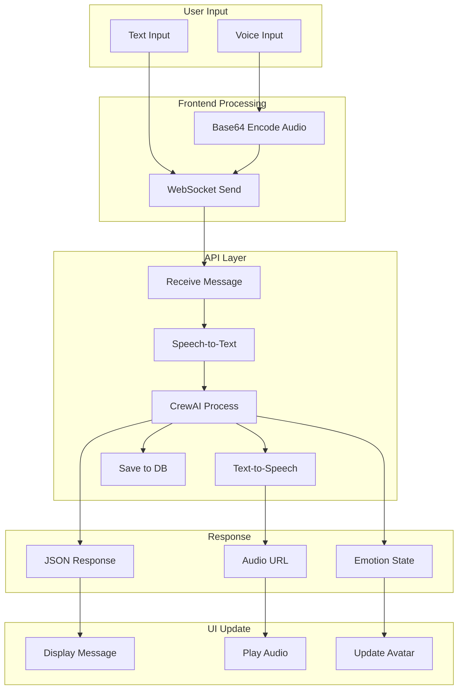

---

## Error Handling Flow

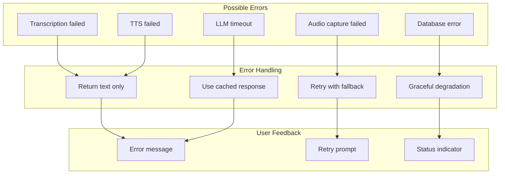

---

## Performance Considerations

| Stage | Expected Latency | Optimization |
|-------|-----------------|--------------|
| WebSocket connect | ~50ms | Keep-alive |
| Audio upload | ~200ms | Compress before send |
| Transcription | ~1-3s | Streaming API |
| LLM Response | ~2-5s | Streaming response |
| TTS Generation | ~500ms | Cache common phrases |
| Total (voice) | ~4-10s | Parallel processing |
| Total (text) | ~3-7s | Skip STT step |

---

## Summary

The AI Character system processes user input through a multi-stage pipeline:

1. **Input Capture**: Text or voice from the browser
2. **Transport**: WebSocket for real-time communication
3. **STT (if voice)**: AWS Transcribe for Japanese
4. **AI Processing**: CrewAI orchestrates 3 specialized agents
5. **Response Generation**: Context-aware, persona-consistent
6. **TTS**: AWS Polly neural voice synthesis
7. **Delivery**: Real-time response with audio playback
8. **UI Update**: Avatar emotion sync, message display

All processing is designed for Japanese language support with AWS services optimized for the `ap-northeast-1` region.

